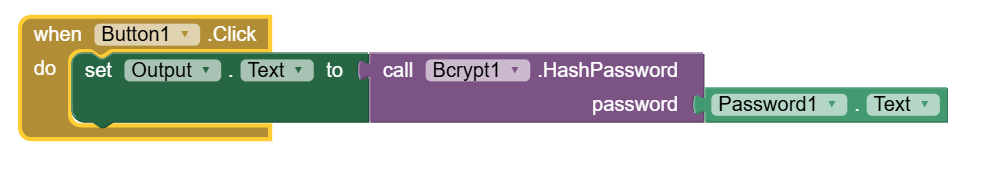
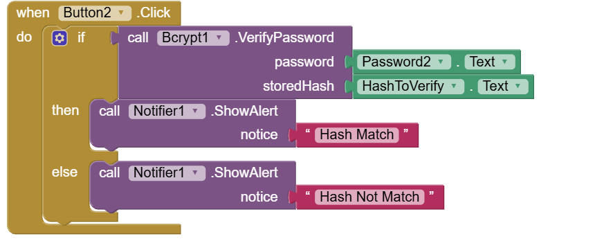

## Bcrypt

A simple and secure extension for App Inventor 2, created using Rush. This extension allows you to hash passwords and verify them using the bcrypt algorithm, ensuring strong security for your applications.

*This project is created for school assignment*

## Hashing Password

## Verifying Password

